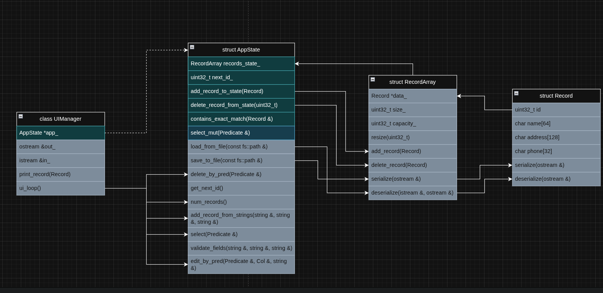

# CMS

View the project at: <https://github.com/GH057W47CH3R/CS121_Project>

Katie Bridges, Ethan Mejia, Kaleb Hankerson

Description: We are creating a simple contact management system that has the functions for the user to add, delete, search, list, save and even load all contacts that are or were added by the user with simple inputs. There is even a ‘-h’ command that tells the user all the available commands within the program. When adding, searching and listing the contacts, it saves it to the disk so that everything that is added or deleted is put all in one place so the user does not have to put everything back in one thing at a time, everything stays or is removed from the list when deleted from the system/memory.

What we’ve done so far: We have created the whole system, making everything into chunks and pushing changes into our group’s Github, then each one of us has taken our corresponding sections and tied them together and have since got it working seamlessly.

What we want to do during the project session: We plan on writing any missing documentations since our main project and its code is finished.

**Project Purpose and Problem Statement:**  
The purpose of this project was to build a simple and efficient Contact Management System that stores fixed-size contact records in memory and saves them to disk in a binary format. The core problems that were solved by this project are:

- How to maintain a dynamic list of records  
- How to add, delete, edit, and view them efficiently  
- How to persist the state to a file and reliably load it  
- How to assign unique, increasing IDs

**High Level Design Overview:**  
The program uses several structs including one main manager object, AppState, and client manager object, UIManager. AppState to organize contact data, handle operations changing the state, and manage serialization. UIManager has an input and output stream and provides operations to interact with the user and AppState.  
**Currently Implemented Features:**  
**Add Records:**  
The user provides a name, address and phone number to create a new contact. AppState automatically assigns a unique ID, inserts the record into the record array, and resizes the memory if needed.  
Ex: ADD “John Doe” “123 W Bradshaw, Chicago, IL 23435” “(123) 456-7890”  
**Select Records:** The user provides 1 field to match on, an operation, and a value to construct a predicate.
Ex: SELECT id \< 5  
Lists the records that have id’s less than 5\.  
Ex: SELECT name \= John Doe  
Lists the records that have the name John exactly.  
Ex: SELECT name \* John
Lists the records that have names with John as a substring.  
**Delete Records:**  
Using the same interface as Selecting, iterate through AppState’s RecordArray and delete the selected records.  
Ex: DEL id \< 5  
Deletes the records that have id’s less than 5\.  
Ex: DEL name \= John Doe  
Deletes the records that have the name John exactly.  
Ex: DEL name \* John
Deletes the records that have names with John as a substring.  
**Edit Records:** Select the records to modify using the same interface as Select. Then specify one field to change and the new value. Note id is not editable.  
Ex: Edit address \= 123 W Bradshaw, Chicago, IL 23435|address=”123 W Clark St, Atlanta, GA 23435”  
Edits all records with the current address 123 W Bradshaw, Chicago, IL 23435 to the new address 123 W Clark St, Atlanta, GA 23435\.
**List Records:**  
Lists all records stored in AppState’s RecordArray.  
**Save to File:**  
Writes the count, next\_id\_, and each Record struct into a binary file.  
**Load from Binary File:**  
Reads the file in the same order it was written in. Then it reconstructs the number of records, the next ID to be used, and all the record data.  
**Future Directions:**

- Provide a more expressive predicates system for SELECT.  
- Save to disk after every operation that changes state.  
- Make the input format more ergonomic.

## Documentation

To build: (note: the first command only needs to be ran once
future builds only need to call the second.)

```
  cmake -S . -B build
  cmake --build build
```

To run

```

  ./build/cms
```

## Layout

The project is laid out with a core library that is used by app. The app
directory is where the executable is built from. It includes parts of core.
We use cmake to build the project.

## Class Spec

- Record := The data type of the information stored per person.
- RecordArray := is an array of records with an associated size and capacity.
- AppState := The state of the app which includes RecordArray.
- UIManager := Holds input/output stream references and provides a ui_loop function which
the primary interaction loop.


